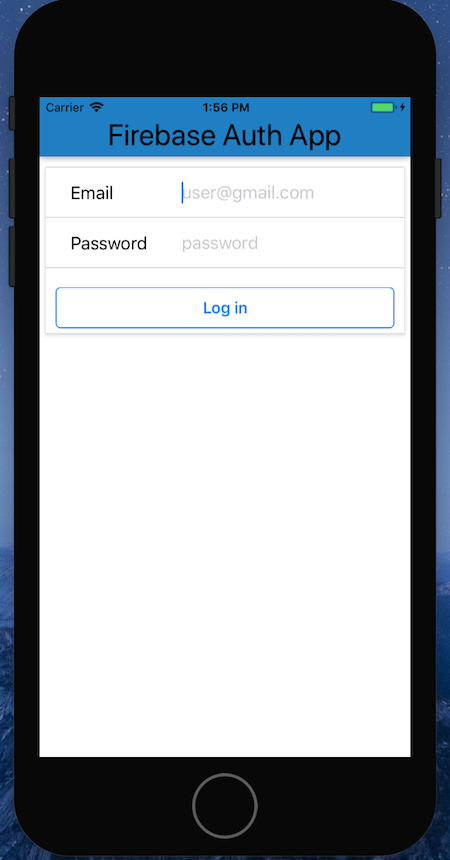
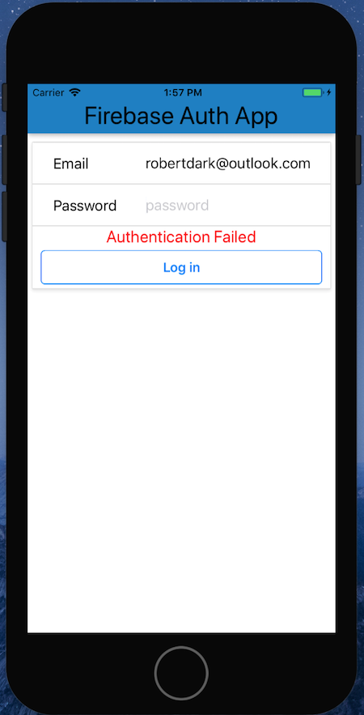
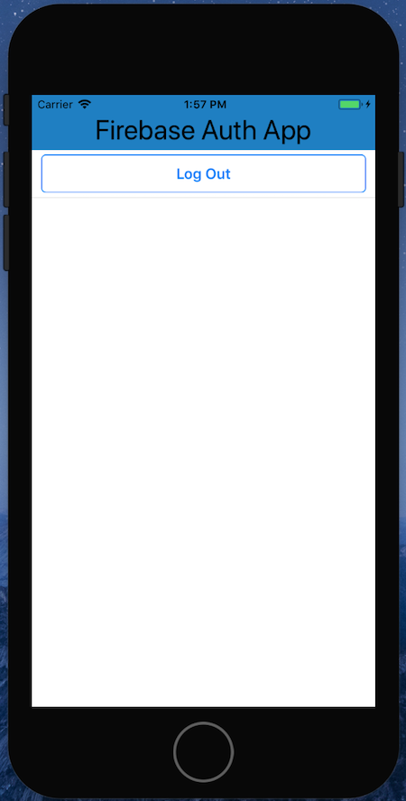
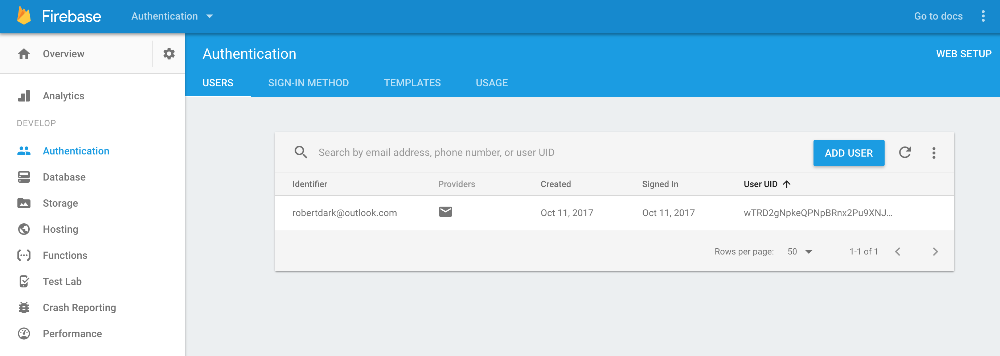

# react-native-authorization

This is a very simple Android/iOS mobile application that utilizes Firebase as a user verification database. 

This was my first forray into React Native and mobile app development. With prior React experience, React Native 
is fairly intuitive, but there are key differences in syntax and import libraries that I mostly familiarized myself with
through building this app. 

Upon loading, this app will redirect to a sign-in screen if no user is detected, then will verify sign-in with Firebase
user database. It will display error message, and allow a verified user to sign-out.

